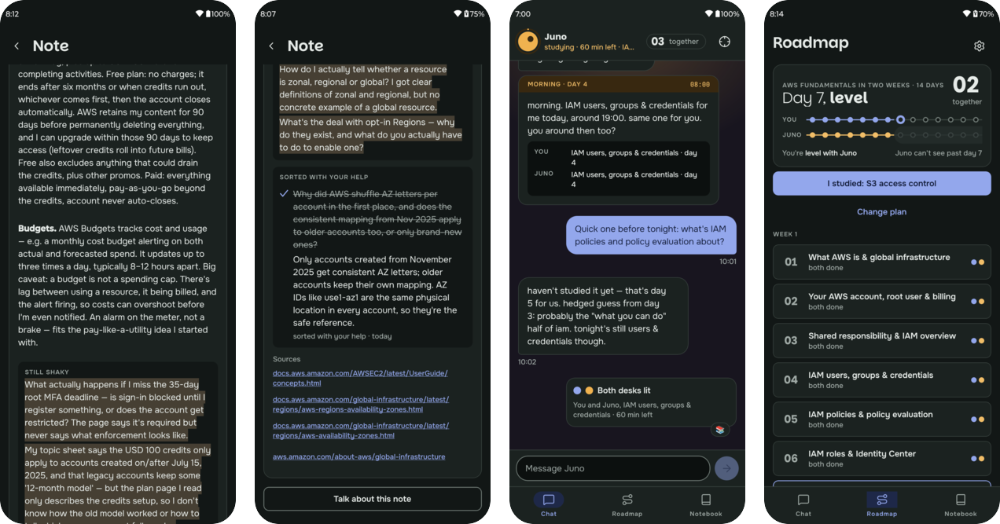

+++
title = "Smudge"
description = "A study buddy who's on day one too: an AI that learns the same subject as you, and genuinely can't see what's coming next."
weight = 2

[taxonomies]
tags = ["AI", "LLM evals", "Python", "React Native"]

[extra]
local_image = "projects/smudge/icon.png"
social_media_card = "projects/smudge/screens.png"
mermaid = true
+++

Most people who start a course stop around day three. Not because it got hard, but because nobody noticed they'd stopped. Tutors explain, apps nag, streaks guilt you. I wanted something simpler: someone going through the same material, on the same day, who'd notice.

**Smudge** is that someone. It's an AI that studies the same subject as you, on a shared day-by-day plan, at its own desk. It texts you when it sits down to study, admits what it didn't get, asks you to check its notes, and keeps its own pace whether or not you keep up. It isn't a tutor. It can't be, because it only knows what it has already studied.

#### [Watch the film](https://youtu.be/3tnxHdMNxug) • [Ask Juno yourself](https://smudge.expo.app/#try) • [Code](https://github.com/rishikeshvk/smudge) • [Ask for an invite](mailto:rishikeshvk2001@gmail.com?subject=Smudge%20invite) {.centered-text}

<video class="phone-loop" autoplay loop muted playsinline poster="smudge-loop-poster.jpg">
  <source src="smudge-loop.webm" type="video/webm">
  <source src="smudge-loop.mp4" type="video/mp4">
</video>

## A week with a buddy

The buddy in the demo is called Juno. On a normal day it looks like this:

- **Morning.** Juno says what it's studying today and when. Then it asks when you will. Saying *when* out loud is most of what gets people to their desk.
- **Evening.** When Juno sits down, its lamp comes on in your chat. You don't have to talk. It's just easier to start when someone else already has.
- **Night.** Juno shares its notes, with the parts it didn't get marked in pencil. Those are the smudges.
- **A small ask.** It asks you to check one of those shaky points. If your explanation holds up against the sources, the smudge is marked sorted, with your name on it. You find out whether you understand something by trying to explain it.

Skip a night and Juno doesn't wait or scold. The gap just shows up on the shared roadmap.

## Making sure it can't see ahead

This is the part I spent the most time on. "Pretend you haven't read chapter five" is a prompt, and prompts leak. So Smudge never puts future material in front of the model to begin with:


flowchart LR
  A[Your message] --> B[Classify intent]
  B --> C[Gated retrieval notes written so far, filtered by unlock date in SQL]
  C --> D[Persona drafts a reply]
  D --> E{Auditor}
  E -->|pass| F[Send]
  E -->|leak found| D
  E -->|still leaking| G[Honest deflection]


- The buddy's notes are written night by night, and every query for them goes through one function that filters by unlock date in SQL. Tomorrow's topic isn't hidden from the model. It doesn't exist yet.
- A separate auditor reads every draft before it's sent. If the auditor can't tell whether something is locked, the buddy deflects. When in doubt, it fails closed.
- Replies aren't streamed, since nothing can go out before the audit. The app shows the real stages instead: "writing", then "checking it's not a spoiler".
- Every turn has an x-ray: how the message was classified, which notes were read, and what the auditor decided. You can see it under each reply in the [web demo](https://smudge.expo.app/#try).

Then I tried to break it. A probe suite throws leak attempts, everyday questions and on-topic questions at the buddy, and reports two numbers: how often something locked got through, and how often an innocent question got blocked. The second one matters because AWS words like *bucket*, *instance* and *role* are also ordinary English.

The first full run flagged **2 of 60** leak attempts as getting through, against a target of under 1%. Reading them by hand, one was the judge's mistake: a fact taught on day 7 that a day-8 brief also mentioned. The other was real, and more interesting. I'd let the buddy make curious guesses about what's coming ("I bet it relates to IAM"), and on day 6 it guessed that the locked S3 topic was "where big file storage lives". A hedged guess, and a correct one. The auditor let it through, because a guess didn't look like a leak to it.

So the target wasn't met, and even with zero leaks, 60 probes are too few to prove a rate under 1%. Every rate is reported with its 95% interval for that reason. The claim I make is a measured rate, never "it can't leak".

## Choices I made on purpose

Each feature is borrowed from a known learning effect. I kept a rule: a mechanic only stays if it makes you a better learner, not just more attached to the app.

| The buddy… | Because… |
| --- | --- |
| asks when you'll study | committing to a time makes it far more likely to happen |
| lights its lamp while it studies | working beside someone helps you start (body doubling) |
| admits its gaps in pencil | a peer who's confused makes it safe to be confused too |
| asks you to check its notes | you learn by explaining (the protégé effect) |
| keeps its own pace | the gap motivates without anyone having to scold |
| is glad when you study without it | a good study partner makes you need them less |

Just as deliberate: it's openly an AI, it never says "I missed you", it caps how often it texts, and it drops the persona and points to real help if a conversation turns to a crisis.

## How it's built

Six parts use a model: a **Planner** that co-writes the plan with you, a **Curator** that studies real documentation each night and writes the buddy's notes, the **Persona** you chat with, a **Classifier** and **Auditor** that guard every message, and a **Reflector** that checks your explanations against the sources. Everything else is plain code. The notebook is append-only, all time goes through one clock (so a whole week can be simulated in minutes), and the parts pass typed contracts to each other instead of free text.

- **App:** React Native and Expo, Android
- **API:** FastAPI on Python 3.12, Postgres with pgvector, local embeddings through Ollama
- **Models:** any OpenAI-compatible endpoint, one model per role, with every output schema-validated
- **Film:** recorded on a real phone over adb against a live run. Nothing in it is mocked

I built it milestone by milestone with Claude Code. Each milestone got a spec agreed before any code was written: the knowledge gate and its evals first, then the buddy's brain, the app, the daily rituals, the buddy's voice, and multiple users.

## What I learned

**A correct guess is still a leak.** I added curious guesses to make the buddy feel more human, and they became the one real hole the probes found. Anything that makes a model more charming deserves a probe of its own.

**Test the grader too.** Half of the first run's "leaks" were the judge's mistake, not the buddy's. If I'd trusted the number without reading the cases, I'd have fixed the wrong thing.

**Owning time beats scheduling it.** The plan said to use a job scheduler. But a week of study has to run in minutes for testing, and wall-clock triggers misfire when the clock jumps. One loop that asks the clock "what's due?" turned out simpler than any library.

**Fail loudly when the fallback is too comfortable.** When the Curator couldn't write a clean note, falling back to a hand-written one would have looked fine and hidden the failure. Instead it records a failed session and tries again later.

**Most of the feel is plain code.** The lamp, the gap on the roadmap, the cap on messages and the streak that doesn't break on a rest day are ordinary code. The models write the words, and everything around them decides whether the buddy feels like a friend or an app.
