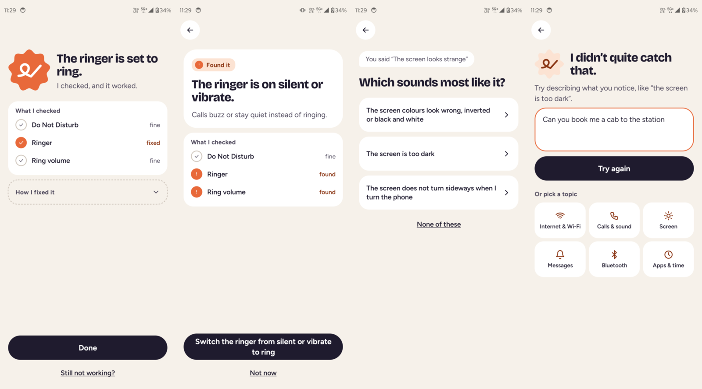
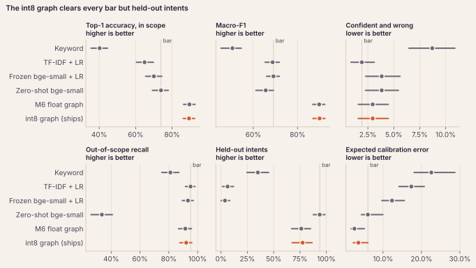
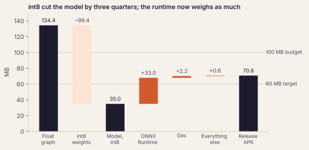
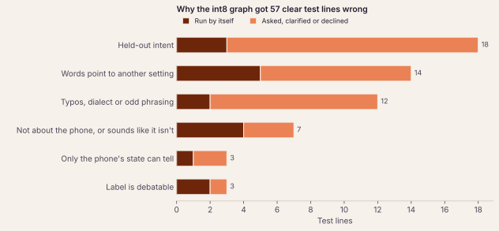

+++
title = "Unstuk"
description = "An offline Android app that fixes your phone from a plain complaint. A 35 MB model on the phone picks the fix, and ordinary code makes it and checks that it worked."
weight = 1

[taxonomies]
tags = ["AI", "On-device ML", "Android", "Kotlin", "Python"]

[extra]
local_image = "projects/unstuk/icon.png"
social_media_card = "projects/unstuk/screens.png"
mermaid = true
+++

People who aren't comfortable with phones don't say "TalkBack is on". They say the phone is talking to them. "My phone doesn't ring" could be Do Not Disturb, a silent ringer or the ring volume at zero. The fix is usually one switch, but you have to know what it's called and where this particular phone maker put it.

**Unstuk** takes the complaint as typed and fixes the phone. A 35 MB model on the phone reads the complaint along with the phone's current settings, and picks one problem from a fixed list of 15. After that, ordinary code takes over. It works out which cause applies, changes the setting, and reads the phone again before it says anything worked. The model never writes text that gets run or shown. All it does is choose, with a probability.

It also works with no internet at all. The person who needs help is often the one whose internet just broke, so the app doesn't even ask for the permission.

#### [Get the preview APK](https://github.com/rishikeshvk/unstuk/releases) • [Read the write-up](https://github.com/rishikeshvk/unstuk/blob/main/docs/writeup.md) • [Code](https://github.com/rishikeshvk/unstuk) {.centered-text}

<video class="phone-loop" autoplay loop muted playsinline poster="unstuk-loop-poster.jpg">
  <source src="unstuk-loop.webm" type="video/webm">
  <source src="unstuk-loop.mp4" type="video/mp4">
</video>

## What it does

From the left: "my phone doesnt ring anymore" gets fixed and checked. "My phone is too quiet" finds the ringer on silent, but asks before switching it. "The screen looks strange" could be three different things, so it asks which one. And "can you book me a cab to the station" isn't a phone problem, so it says it didn't catch that and offers some topics instead of guessing.

Which of these you get depends on how sure the model is and how risky the fix is:


flowchart LR
  A[Complaint + phone's settings] --> B[Model on the phone picks a problem, with a probability]
  B --> C{Risk gate}
  C -->|low risk, sure| D[Run the fix]
  C -->|less sure, or medium risk| E[Ask first]
  C -->|unsure or off-topic| F[Ask which one, or say no]
  C -->|high risk| G[Steps to follow]
  E -->|yes| D
  D --> H[Read the phone again]
  H --> I[Report]


- A low-risk fix runs by itself only when the model is at least 75% sure. Between 70% and 75% it asks first. Below 70%, or if the complaint looks off-topic, you get a question or a polite no.
- Medium-risk fixes always ask. Anything destructive is never automated, and you get steps to follow instead.
- Nothing is reported as fixed until a fresh read of the phone agrees. A timeout counts as a failure. In every run on a real phone so far (40 trials, then 20 scripted complaints, then 17 more) there were zero false successes.

## Getting the fix done

Android lets a normal app change very few settings directly. So each fix climbs a ladder and uses the first rung it has:

1. A direct API, where one exists. Brightness and the ringer work this way.
2. A Settings panel that opens right on the switch, and you tap it. Wi-Fi and automatic time are like this.
3. Accessibility automation, where Unstuk taps the switch for you in Quick Settings or Settings. Airplane mode and TalkBack need it.
4. Step-by-step instructions.

This is the hard part, so I built it first, before there was any model. Every phone maker labels its switches a bit differently, and those labels live in data files instead of code. So far only my Moto Edge 30 is fully tested.

## Did the model earn its place?

Before training anything, I scored cheap baselines on a frozen test set: a keyword matcher, TF-IDF with logistic regression, and the same small encoder used zero-shot. No baseline won on every metric, so each metric got its own bar, set by whichever baseline did best on it. The model had to clear those bars or it wouldn't ship.

The test set has 602 lines. It was written and locked before any training data existed, by ChatGPT, Gemini and a Claude with no project context. The training data came from separate Claude agents, each one playing a different kind of user (age, comfort with phones, English variety, typos). The test has Indian English, negation ("calls ring fine, but…"), long stories, and traps like "my ring finger hurts". Three of the 15 problems never show up in training at all.

The shipped model gets 89.3% of in-scope complaints right, against 73.9% for the best baseline. On 3.0% of lines it would run a fix by itself for the wrong problem. That's the number I watch most, and TF-IDF gets 1.9% there, so the model only matches it within the interval. Calibration error is 3.6%, which roughly means that when it says 90%, it's right about 90% of the time. That matters here because the confidence decides whether the app acts on its own.

It fails one bar. On the three problems it never trained on, it gets 77.5%, against 93.8% for zero-shot.

And all of this is on complaints written by language models. Real people's messages come next: people get symptom cards ("Your daughter says she called you three times this morning…") and type what they'd ask. The model only counts as done if it still beats the baselines on those. Until then the APK is called a preview.

## On the phone

The encoder is bge-small, with 33M parameters. In int8 it's 35 MB, down from 134 MB, and on the test set that cost nothing I could measure. One decision takes 9.6 ms on the Moto. The APK is 70.8 MB, and ONNX Runtime itself is now 33 MB of that, nearly as much as the model.

Something I didn't expect: ONNX Runtime's library asks for the `INTERNET` permission in its manifest, and it got merged into the app without me noticing until the first signed build. The app strips it now, and the build fails if it ever comes back.

## Where it goes wrong

The model gets 57 of the 574 clear test lines wrong. I gave each one a cause from a list I wrote down before reading any of them. The biggest group is the three untrained problems, and half of those get turned away as off-topic, because anything unfamiliar looks off-topic to it. Next is wording that points at the wrong setting. "Calls ring normally, but my WhatsApp texts come silently" gets read as the ringer, at 0.99.

Gemini's lines were the hardest. Gemini wrote 255 of the clear test lines and 40 of the 57 mistakes. The model got 84.3% of its lines right, against about 95% for the other two writers. Gemini reaches for unusual words ("the glass", "the backlight"), and Claude wrote all the training data. That gap is the best argument I have for testing on real people.

## What I learned

**Score the model the way the app runs it, on the chip it runs on.** The int8 model passed every check on my laptop. Then the phone disagreed with Python on 8 lines, by up to 0.48 in probability. There were two reasons. Dynamic int8 sets its scale from the whole batch, padding included, so a line's answer depended on the 63 lines scored next to it, and the phone scores one line at a time. And my laptop's x86 chip computes these products with an instruction that can saturate, which the phone's ARM chip doesn't. After fixing both, the phone gave Python's top answer on all 1,144 dev lines. Only a line-by-line comparison on the actual phone caught either one.

**The thresholds did more than the training.** I tried to teach the model to be unsure by training it on vague complaints. It didn't help. Moving the gate's lines did.

**A new problem needs examples.** My plan said a new problem would work from its description alone. Seven rounds of experiments said otherwise. The model could still name it, but every off-topic check I tried turned away a fifth or more of its lines just for being unfamiliar. Now a new problem ships with a few dozen training lines.

**TF-IDF is hard to beat on safety.** Character n-grams cope well with typos, and it's rarely sure of anything. The neural model is far more accurate, but on wrong fixes run by itself, it only just matches TF-IDF.

**Write the stop rule before you see the result.** Every experiment had its comparison, its bar and its point to give up written down first. A few ideas I liked didn't make it because of that, and I'd rather know.

## How it's built

- **App:** Kotlin and Jetpack Compose, with an accessibility service that does the tapping
- **Model:** bge-small-en-v1.5, fine-tuned to score a complaint against each problem's one-line description, plus a head that says whether it's off-topic. Exported to int8 ONNX and run with ONNX Runtime
- **Training:** Python with uv, on Colab GPUs
- **Catalog:** the problems, their descriptions, fixes and risk levels live in one place, and both the training code and the app read it

Scoring against descriptions instead of one output per problem made a real difference. The same encoder with a plain classification head got 75.4%. Reading the descriptions got 87.1%, with half the confident mistakes.

I built it milestone by milestone with Claude Code, and each milestone got a spec agreed before any code was written: the executor first, then the catalog and a rules version, the data, baselines, training, calibration, getting it onto the phone, and the write-up. Testing on real people's messages is the one still open.
